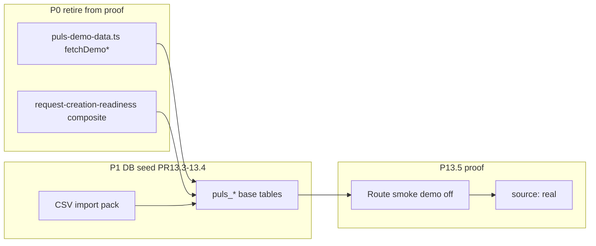

# PR13.2 — Embedded Demo Retirement Plan

Actionable retirement roadmap converting [`13_embedded_demo_dependency_map.md`](./13_embedded_demo_dependency_map.md) into P0/P1/P2 work packages with replacement DB paths, acceptance criteria, and PR13.3–13.5 ownership.

**Documentation-only.** PR13.2 does **not** remove code. Embedded TypeScript demo data may remain temporarily as a dev fallback, but it cannot be used as V1 packaging proof.

Production-facing product behavior must not depend on embedded TypeScript business fixtures.

## Executive summary

PR13.1 inventoried ~23 `puls-demo-data.ts` exports plus adapter-level composites. PR13.2 groups them into **sprintable retirement packages** with:

- Explicit P0 paths that must exit packaging proof before V1 signoff
- P1 paths replaced by DB-backed demo tenant seed (PR13.3–13.4) and bootstrap proof (PR13.5)
- P2/static paths allowed as dev fallback until bootstrap lands

See [`13_packaging_proof_demo_guardrails.md`](./13_packaging_proof_demo_guardrails.md) for what counts as proof vs dev fallback.

## Retirement taxonomy

| Priority | Meaning |
|----------|---------|
| `P0_retire_for_packaging` | Must remove from packaging proof path before V1 signoff |
| `P1_replace_with_db_seed` | Replace with DB-backed demo tenant seed (PR13.3–13.5) |
| `P2_keep_dev_fallback_temporarily` | Dev fallback OK until bootstrap; not packaging proof |
| `test_only_ok` | Unit/integration tests only |
| `static_placeholder_ok` | Static/teaser UI; not product-ready AI |

## P0 retirement work packages

Must not appear in packaging proof after PR13.5 bootstrap. Proof requires `VITE_PULS_DEMO_MODE=false` (or unset), DB seeded, `source: real` — see guardrails doc.

| Package | Demo dependency | Adapter / route | Replacement DB objects | Owner PR | Packaging proof check | Acceptance criteria |
|---------|-----------------|-----------------|------------------------|----------|----------------------|---------------------|
| Dashboard composite | `fetchDemoDashboardPageData`, `fetchDemoDashboardOverview`, `fetchDemoLeaveOverview`, `fetchDemoExpenseOverview` | `/dashboard`, `dashboard/overview.ts` | `puls_calc.dashboard_overview`, underlying leave/expense calc | PR13.5 | Dashboard loads KPIs with demo mode off | No demo pill; calc views populated from seed |
| Leave overview | `fetchDemoLeaveOverview` | `/izin`, `leave/overview.ts` | `puls_calc.leave_overview`, `leave_balances`, `leave_types` | PR13.5 | Overview `source: real` | Balances/types visible without demo flag |
| Expense overview | `fetchDemoExpenseOverview` | `/masraf`, `expense/overview.ts` | `puls_calc.expense_overview`, `expense_categories` | PR13.5 | Overview `source: real` | Claims/categories from DB seed |
| Employee directory | `fetchDemoEmployeesOverview`, inline `fetchDemoEmployeeList` / stats | `/calisanlar`, `core/employees.ts` | `puls_core.employees`, `puls_calc.employee_list_overview` | PR13.3, PR13.5 | List + stats `source: real` | 20-40 seeded employees; no inline demo wrappers in proof |
| Employee assignment readiness | `fetchDemoEmployeeAssignmentReadiness` | `setup/employee-assignment-readiness.ts`, `/sirket-kurulum` | `employee_reporting_lines`, `employee_cost_center_assignments` | PR13.3 | Readiness from real assignment rows | Assignment gaps computed from DB |
| Performance overview | `fetchDemoPerformanceOverview` | `/performans`, `performance/overview.ts` | `puls_performance.*`, `puls_calc.performance_overview` | PR13.5 | Overview `source: real` | Scores/cycles from seed, not demo composite |
| Career (rich UI) | `fetchDemoCareerOverview` | `/kariyer`, `career/overview.ts` | `career_profiles`, `training_needs` or honest empty | PR13.3 | Either DB-backed map or documented empty-ok | No rich demo-only career narrative in proof |
| Request-creation-readiness composite | **Private composite** in `request-creation-readiness.ts` — local `fetchDemoRequestCreationReadiness()` orchestrates `fetchDemoLeaveOverview`, `fetchDemoExpenseOverview`, `fetchDemoLeaveTypesOverview`, `fetchDemoExpenseCategoriesOverview`, `fetchDemoEmployeeAssignmentReadiness` (**not** a `puls-demo-data.ts` export) | `/izin`, `/masraf` create flows | Seeded balances, types, categories, assignments | PR13.3, PR13.5 | Create readiness banners `source: real` | Leave/expense create enabled from DB seed without demo composite |

## P1 replacement packages

Replaced by DB-backed demo tenant seed (PR13.3 spec, PR13.4 CSV) and verified in PR13.5 bootstrap smoke.

| Package | Demo dependency | Adapter / route | Replacement DB objects | Owner PR | Acceptance criteria |
|---------|-----------------|-----------------|------------------------|----------|---------------------|
| Departments | `fetchDemoDepartmentsOverview` | `/departmanlar`, `core/organization.ts` | `puls_core.departments` (PULS-owned + imported) | PR13.3 | Mixed CRUD demo with both source classes |
| Positions | `fetchDemoPositionsOverview` | `/pozisyonlar`, `core/organization.ts` | `puls_core.positions` | PR13.3 | Same as departments |
| Company setup | `fetchDemoCompanySetup` | `/sirket-kurulum`, `setup/company.ts` | `puls_calc.setup_readiness_summary`, tenant/org | PR13.3 | Readiness checklist from real aggregates |
| Leave types + policies | `fetchDemoLeaveTypesOverview`, `fetchDemoApprovalPoliciesOverview` | `/izin-tanimlari`, `setup/leave-types.ts`, `workflow/policies.ts` | `leave_types`, `approval_policies`, steps | PR13.3 | Admin CRUD overview from seed |
| Expense categories | `fetchDemoExpenseCategoriesOverview` | `/masraf-kategorileri`, `setup/expense-categories.ts` | `expense_categories` | PR13.3 | Category admin from seed |
| Cost center readiness | `fetchDemoCostCenterReadinessOverview` | `/masraf-kategorileri`, `setup/cost-center-readiness.ts` (separate WithMeta query) | `cost_centers`, `source_namespaces`, `entity_identity_map` | PR13.3 | ERP/import mapping examples for routing readiness |
| Performance parameters | `fetchDemoPerformanceParametersOverview` | `/performans-parametreleri` | `competency_templates`, `kpi_category_weights`, `score_bands` | PR13.3 | Params route from seed |
| Contracts metadata | `fetchDemoContractsOverview` | `/sozlesmeler`, `contracts/overview.ts` | `puls_workflow.contracts` | PR13.3 | Metadata read `source: real` |
| Profile / account | `fetchDemoProfileOverview` | `/profil`, `profile/overview.ts` | `employees` + calc reads linked to auth | PR13.3 | Persona profile from linked employee row |
| ERP metadata (Canias) | `fetchDemoErpOverview` | `/erp`, `setup/erp.ts` | `erp_connections`, `erp_field_mappings` — **metadata seed only** | PR13.3 | Inactive Canias row + sample mappings; **no Canias runtime** |
| Training | `fetchDemoTrainingOverview` | `/egitim`, `training/overview.ts` | `training_needs` or empty-ok | PR13.3 | Optional catalog rows |

## P2 / static / test posture

| Package | Demo dependency | Priority | Notes |
|---------|-----------------|----------|-------|
| Menu shell | `fetchDemoMenuTenantFallback` | P2 | Minimal tenant counts; seed `menu_overview` in PR13.3 |
| Settings hub | `fetchDemoSettingsOverview` | P2 | Static section list; hub not domain proof |
| Job evaluation | `fetchDemoJobEvaluationOverview` | P2 | Placeholder / `future/not V1` |
| AI Coach teaser | `fetchDemoAiCoachOverview`, `STATIC_AI_COACH_OVERVIEW` | static_placeholder_ok | Not product-ready until PR13.6 |
| Test mocks | `result.test.ts`, adapter tests | test_only_ok | Keep |

## Replacement model summary

## PR13.3–13.5 handoff

| PR | Delivers | Retirement packages unlocked |
|----|----------|------------------------------|
| **PR13.3** | Demo company seed spec (`puls_*` aligned) | All P1 packages; employee/org assignment baseline for P0 |
| **PR13.4** | CSV/import packaging runbook | Imported/source-owned rows; cost center ERP mapping examples |
| **PR13.5** | Bootstrap, reset, scenario scripts, route proof | All P0 packages; request-readiness composite; packaging signoff smoke |

## Non-goals (PR13.2)

- No code removal in `src/**`
- No SQL/CSV fixture files
- No Canias runtime connector work (**no Canias runtime** — metadata seed only until PR13.7)
- No public API / SDK / CRM
- No changes to `VITE_PULS_DEMO_MODE` runtime behavior

## References

- [`13_embedded_demo_dependency_map.md`](./13_embedded_demo_dependency_map.md) — PR13.2 **extends** PR13.1; does not replace inventory
- [`13_feature_db_coverage_inventory.md`](./13_feature_db_coverage_inventory.md)
- [`13_packaging_proof_demo_guardrails.md`](./13_packaging_proof_demo_guardrails.md)
- [`13_demo_data_packaging_principles.md`](./13_demo_data_packaging_principles.md)
